# Sentinel

> Documentation en français [plus bas](#sentinel-fr).

Self-hosted backup orchestrator for your web projects. Schedule database dumps and storage downloads, store everything encrypted, restore in one click from the dashboard.

```
+--------------------+      cron       +-----------------+
|     Dashboard      |  ----------->   |    Connectors   |
|  (SvelteKit + JWT) |                 |  - Turso        |
+--------------------+                 |  - MySQL/SSH    |
          |                            |  - Postgres/SSH |
          |  /api/*                    |  - Vercel Blob  |
          v                            |  - SSH/SFTP     |
+--------------------+                 +-----------------+
|     Fastify API    |                          |
|  + sql.js (SQLite) |                          v
|  + AES-256-GCM     |                  data/backups/<project>/
+--------------------+                  └── daily | monthly /*.zip
```

## Screenshots

> The data shown below is **fictitious** — example projects (« Atelier Saint-Roch », « Coopérative Marais », « Brasserie Lumen »…) generated for the docs. Les données affichées sont **fictives** : projets d'exemple générés pour la documentation.

| Dashboard / Vue d'ensemble | Projects / Projets |
|:---:|:---:|
| 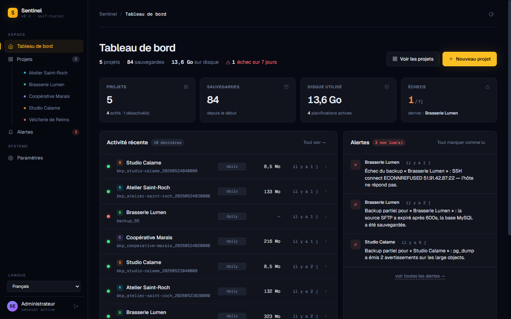 | 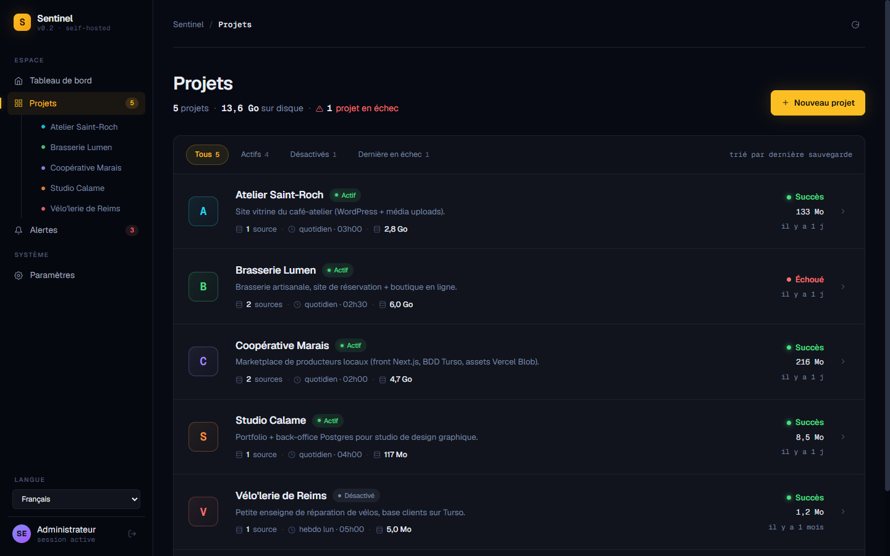 |

| Project — overview / Détail projet | Backup detail / Détail sauvegarde |
|:---:|:---:|
| 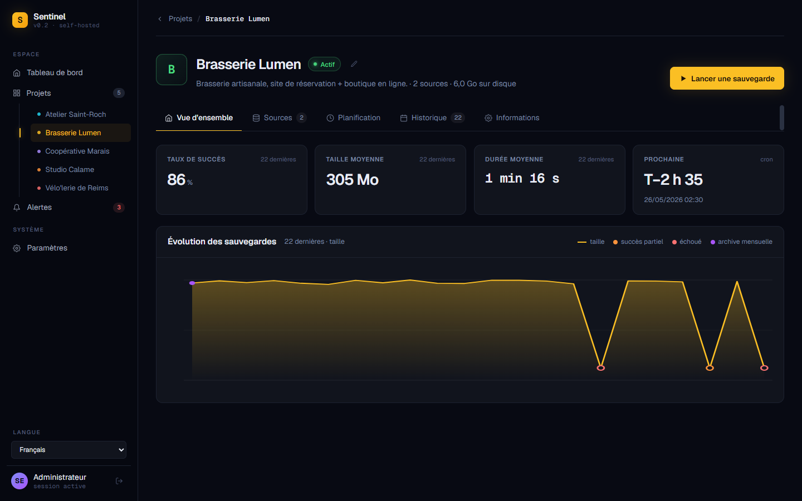 | 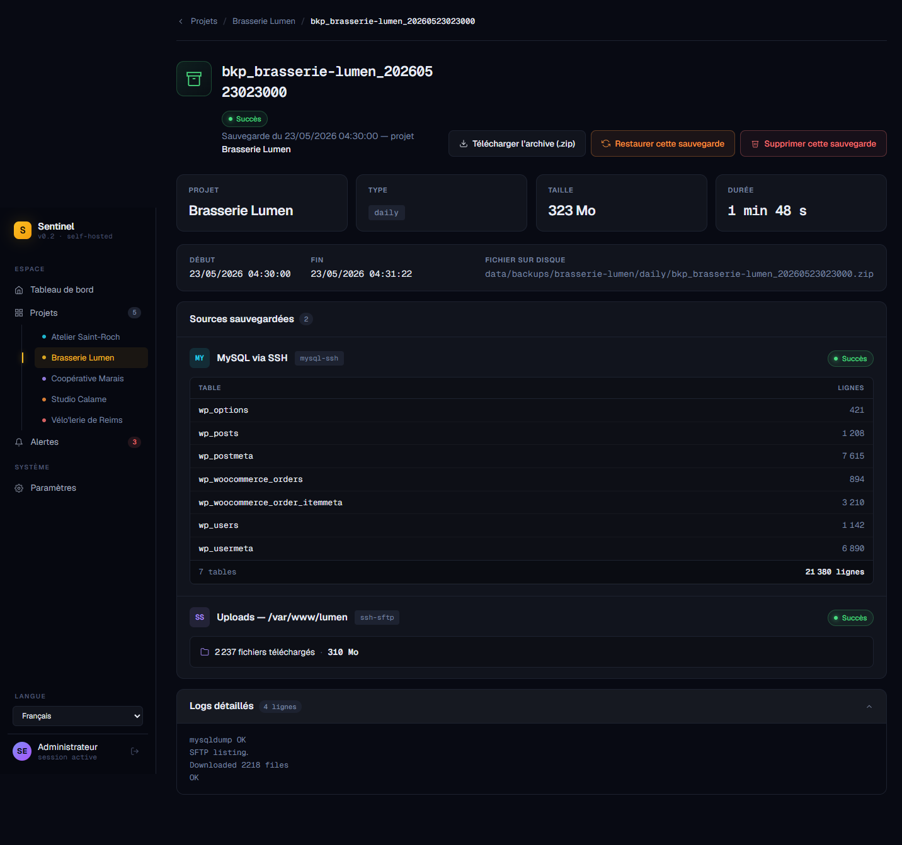 |

| Alerts / Alertes | Settings / Paramètres | Login / Connexion |
|:---:|:---:|:---:|
| 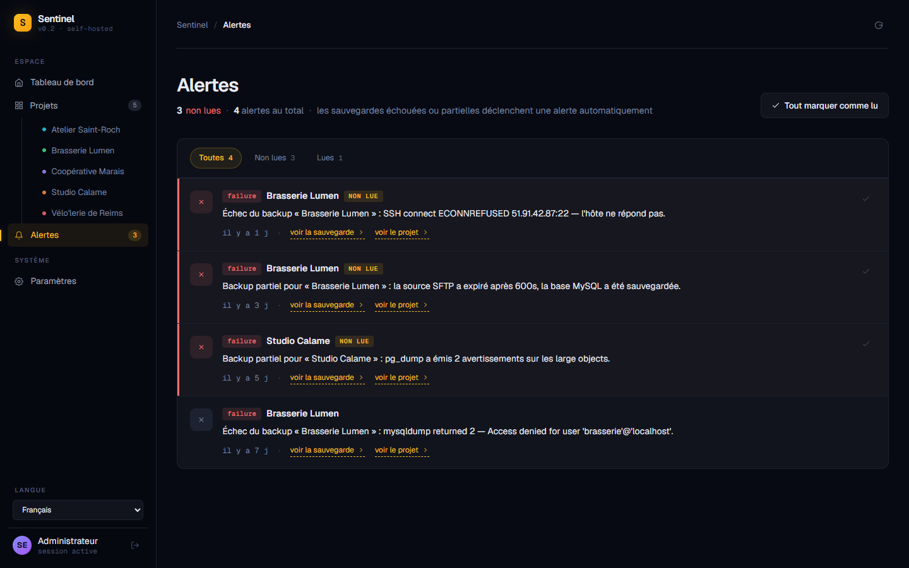 | 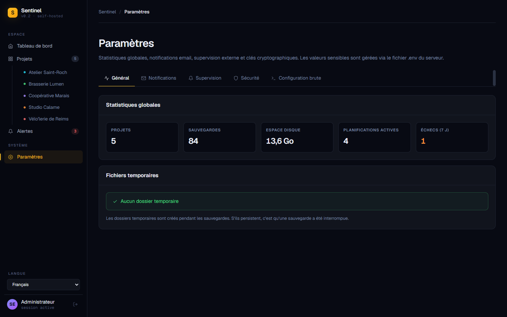 | 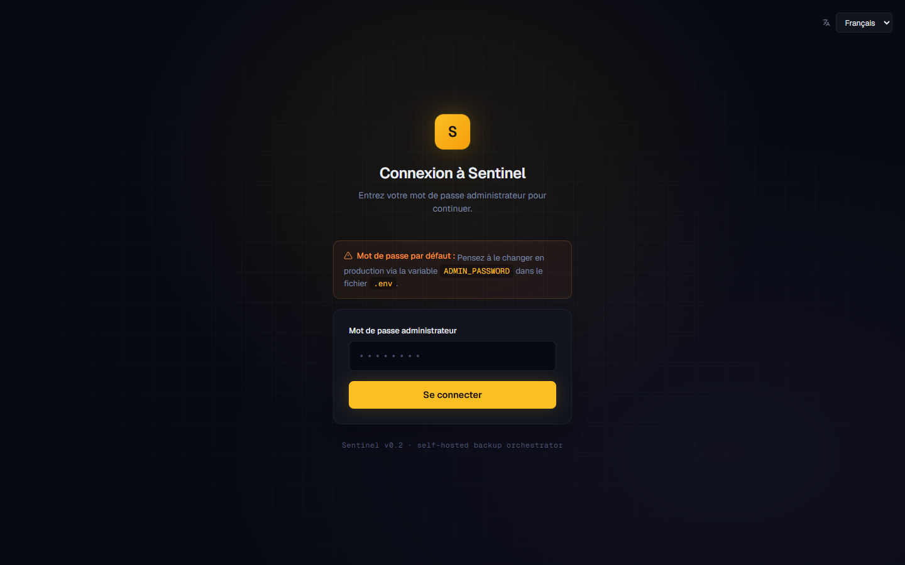 |

<details>
<summary><b>Project tabs / Onglets projet</b> — Sources, Planification, Historique, Informations</summary>

| Sources | Planification |
|:---:|:---:|
| 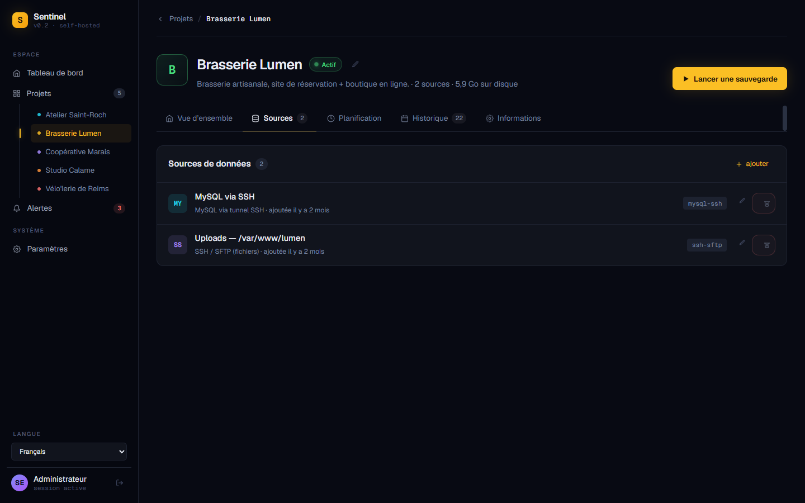 | 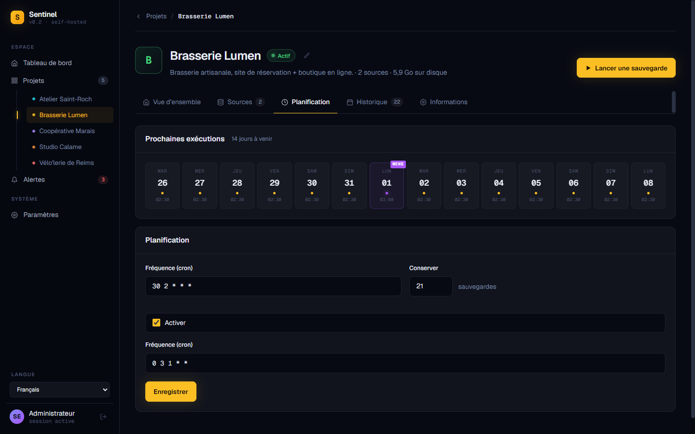 |

| Historique | Informations |
|:---:|:---:|
| 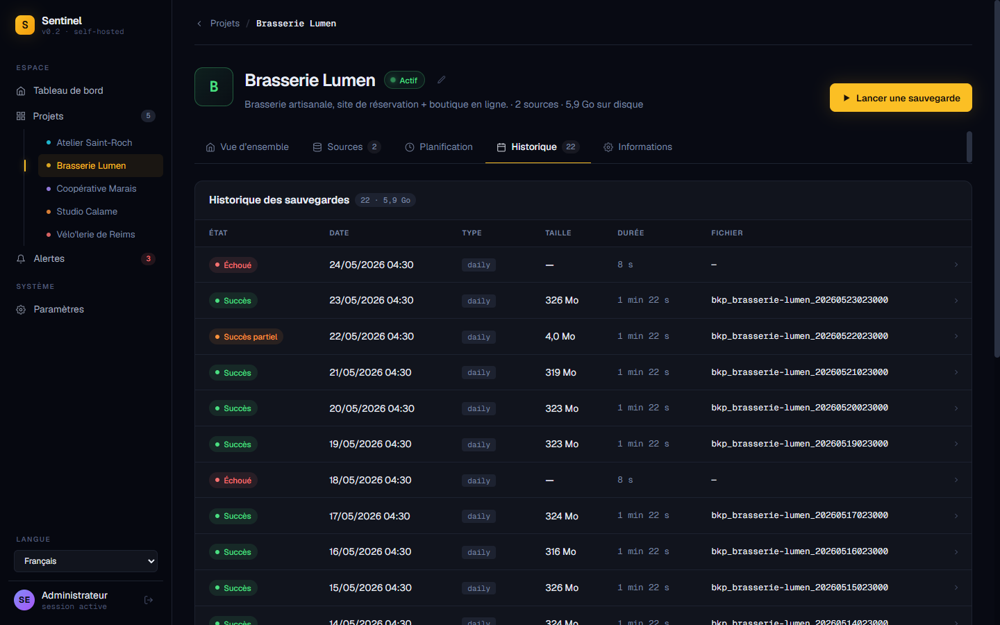 | 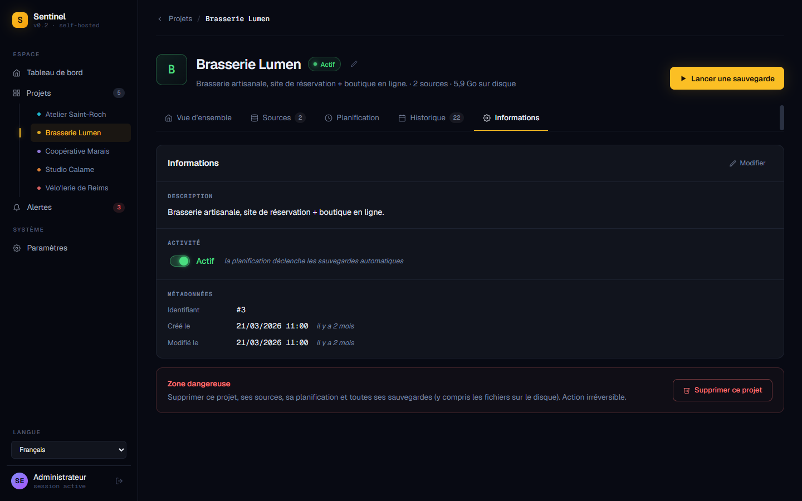 |

</details>

<details>
<summary><b>Settings tabs / Onglets paramètres</b> — Notifications, Supervision, Sécurité, Configuration brute</summary>

| Notifications (SMTP) | Supervision (Healthchecks.io) |
|:---:|:---:|
| 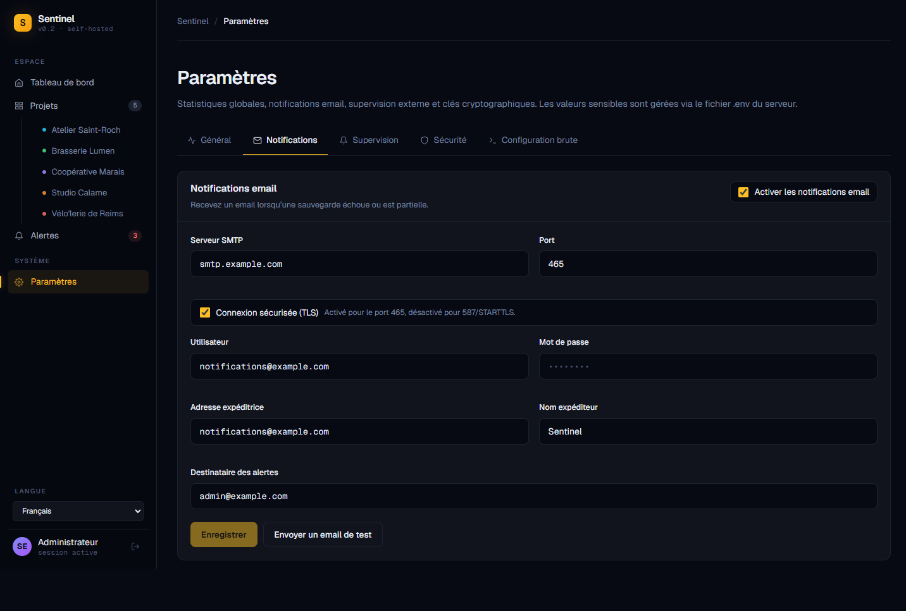 | 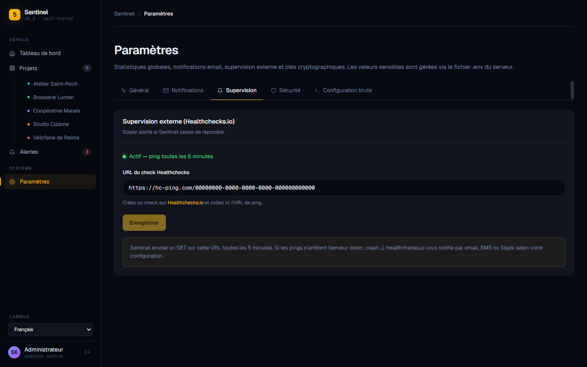 |

| Sécurité | Configuration brute (.env) |
|:---:|:---:|
| 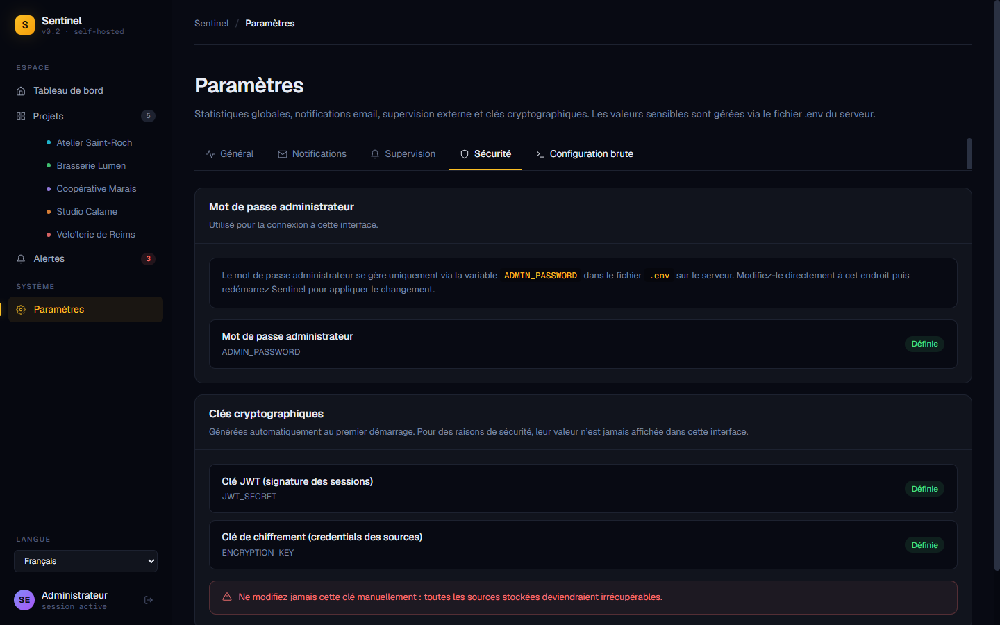 | 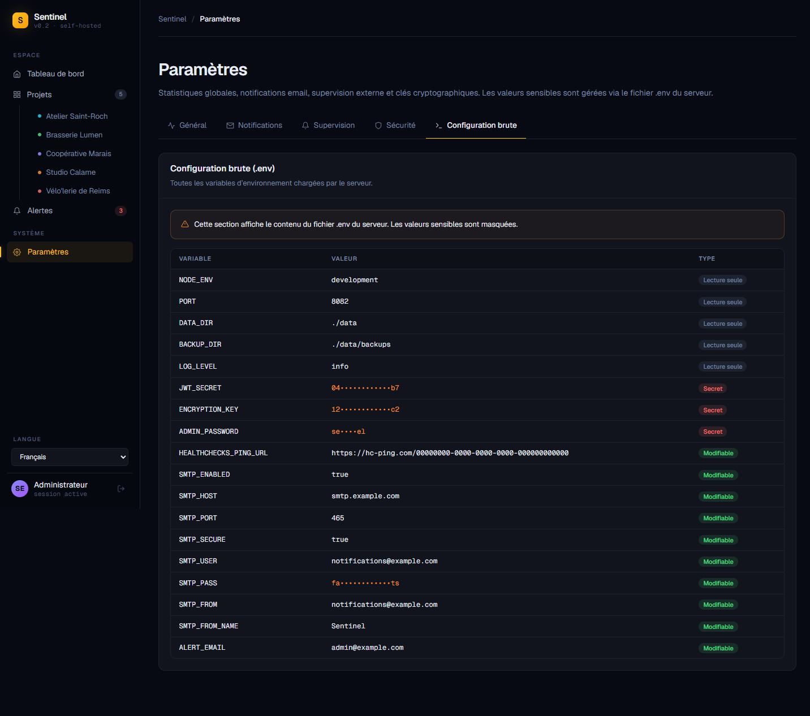 |

</details>

## What is this?

Sentinel is a small dashboard that orchestrates backups for projects you self-host. Tell it where your databases and asset folders are, set a cron schedule, and it produces zipped backups on disk that you can download or restore from a UI.

This is a hobby project, **vibe-coded** with [Claude Code](https://claude.com/code). Most files were written or refactored in conversation. It works for single-admin self-hosting behind a reverse proxy. It is not battle-tested at scale and is not designed for multi-tenant use.

## Why?

- You don't want to pay 5–30 €/month for a managed backup service for a side project.
- You want your backups on a server you control, not in someone else's S3.
- You want one place to look at when something fails, with alerts via email or [Healthchecks.io](https://healthchecks.io).

## Features

- **Modular connectors**
  - Databases: Turso/LibSQL, MySQL via SSH tunnel, PostgreSQL via SSH tunnel
  - Storage: Vercel Blob, SSH/SFTP folders
- **Cron-based schedule** per project; daily + monthly snapshots with separate retention policies
- **Source credentials encrypted at rest** (AES-256-GCM)
- **One-click restore** from the dashboard
- **Email + Healthchecks.io alerts** when a backup fails
- **i18n FR/EN** with auto-detection of the browser language
- **Auto-generated `JWT_SECRET` and `ENCRYPTION_KEY`** at first boot
- **Live `.env` editing** for SMTP and monitoring (no restart needed)
- **Docker-ready**

## Quick start

```bash
git clone https://github.com/LigoLabs/Sentinel
cd sentinel
npm install
npm run setup        # creates .env from the template
npm run dev          # frontend on http://localhost:8081, API on :8082
```

Default password: **`sentinel`** — change it via `ADMIN_PASSWORD` in `.env` and restart.

> Requires Node 22+ and npm 10+.

## Production

### Docker (recommended)

```bash
npm run setup        # creates .env (or copy your existing one)
docker compose up -d
```

App on `http://localhost:8082`. Put it behind nginx / Caddy / Traefik with HTTPS — see [Security](#security-model).

### Without Docker

With PM2 (recommended — manages the process lifecycle, sets `NODE_ENV=production` automatically via `ecosystem.config.cjs`):

```bash
npm install
npm run build
pm2 start ecosystem.config.cjs   # first time only
npm run prod                     # subsequent redeploys: install + build + pm2 reload
```

Without PM2 (useful to test the built app locally):

```bash
npm install
npm run build
npm run start:prod
```

`start:prod` runs the built server with `NODE_ENV=production` forced via `cross-env`, so the server serves the built front in addition to the API.

## Adding a backup, end to end

1. Open the dashboard, go to **Projects → New project**, give it a name and a cron schedule. Presets are provided ("Every day at 3am", "Every 6h"…).
2. Open the project, click **+ Add a source**, pick a type and fill in the connection details. The form shows a per-type explainer of how it works under the hood.
3. Click **Test connection** to verify credentials before saving.
4. Click **Run now** to trigger a backup immediately, or wait for the next cron tick.
5. Backups land in `data/backups/<project-slug>/<daily|monthly>/<bkp_..._YYYY_MM_DD_HH_MM>.zip`. Each archive contains a `metadata.json` with the run details, the database dumps as `.sql` / `.json`, and any downloaded assets.

### Restoring

From a backup detail page → **Restore this backup**. Two confirmations are required. The restore writes back to the source configurations *currently set* on the project — if you've changed the connection details in the meantime, the restore goes there.

For databases: full reset of the schema (`pg_dump --clean --if-exists`, `mysqldump --add-drop-table`).
For storage: re-uploads files preserving the folder structure.

You can also download the zip and restore it yourself with standard tools (`psql < dump.sql`, `unzip + scp`, etc.).

## Connectors

### Databases

| Type | Method | Pre-req on remote |
|---|---|---|
| **Turso / LibSQL** | `@libsql/client` over HTTPS, list tables, export as JSON | — |
| **MySQL via SSH** | SSH tunnel + `mysqldump --single-transaction --routines --triggers --add-drop-table` | `mysql-client`, SSH access |
| **PostgreSQL via SSH** | SSH tunnel + `pg_dump --clean --if-exists` (`PGPASSWORD` env var) | `postgresql-client`, SSH access |

### Storage

| Type | Method |
|---|---|
| **Vercel Blob** | API listing + per-file download with a Read/Write token |
| **SSH / SFTP** | Recursive folder download over SFTP (password or private key, optional sudo) |

## Configuration

After first boot, secrets are auto-generated and persisted to `.env`:

- `JWT_SECRET` (session signing)
- `ENCRYPTION_KEY` (source credentials encryption — never rotate, see warning below)

Day-to-day settings are managed from the dashboard's **Settings** page (SMTP, Healthchecks URL…). The full env schema:

| Key | Purpose | Edit from |
|---|---|---|
| `ADMIN_PASSWORD` | Login password | `.env` (restart required) |
| `JWT_SECRET` | Session signing | Auto-generated, never edit |
| `ENCRYPTION_KEY` | Credentials encryption | Auto-generated, **never** rotate (data loss) |
| `HEALTHCHECKS_PING_URL` | Heartbeat to Healthchecks.io | UI (hot-reload) |
| `SMTP_*` / `ALERT_EMAIL` | Email notifications | UI (hot-reload) |
| `NODE_ENV`, `PORT`, `DATA_DIR`, `BACKUP_DIR`, `LOG_LEVEL` | Process env | `.env` (restart required) |

### `.env.example`

```bash
NODE_ENV=development
PORT=8082

# Auto-generated on first boot if empty
JWT_SECRET=
ENCRYPTION_KEY=

ADMIN_PASSWORD=sentinel
DATA_DIR=./data
BACKUP_DIR=./data/backups
LOG_LEVEL=info

HEALTHCHECKS_PING_URL=

SMTP_ENABLED=false
SMTP_HOST=
SMTP_PORT=465
SMTP_SECURE=true
SMTP_USER=
SMTP_PASS=
SMTP_FROM=
SMTP_FROM_NAME=Sentinel
ALERT_EMAIL=
```

## Security model

This project assumes **single-operator self-hosting behind a reverse proxy with HTTPS**.

- One admin password (`ADMIN_PASSWORD`), no user accounts, no signup, no password recovery.
- Source credentials encrypted at rest with AES-256-GCM. The key lives in `.env` on the host.
- Login is rate-limited (5 attempts / 15 min per IP, then 15 min lockout).
- JWT cookies are `httpOnly`, `sameSite=strict`, and `secure` whenever the request is served over HTTPS (so they still work on a plain-HTTP LAN deployment).
- See [SECURITY.md](./SECURITY.md) for the full threat model and how to report vulnerabilities.

**Don't** expose the dev server (`npm run dev` / `npm start`) to the public internet — it has CORS open for `localhost:8081`. The production server (`npm run prod` via PM2 / Docker) is fine to expose, behind HTTPS.

## Project status

- **Vibe-coded with Claude Code.** Most files were written or refactored in conversation, with the build running between iterations.
- **Battle-testing**: I run it on my own VPS, that's the extent of the testing.
- **No automated tests** at the moment. CI runs `npm run build` on every PR.
- **API/schema**: reasonably stable. Breaking changes will bump the major version.
- **Migrations**: schema is `CREATE TABLE IF NOT EXISTS`. Adding columns to existing tables requires a manual `ALTER TABLE` until I add a real migration system.

## Architecture in 30 seconds

Two npm workspaces:

- **`server/`** — Fastify + sql.js (SQLite WASM, persisted to `data/sentinel.db` after every write) + node-cron + AES-GCM. ESM, NodeNext.
- **`web/`** — SvelteKit 2 + Svelte 5 (runes) + Tailwind v4. `adapter-static`; in production the server serves the SPA via `@fastify/static` with an SPA fallback.

In dev: API on 8082, SvelteKit dev server on 8081 with `/api/*` proxied. In production: a single Node process on 8082 serving both API and static SPA.

See [CLAUDE.md](./CLAUDE.md) for a deeper architecture walkthrough (mostly written for AI agents but useful for humans too).

## Contributing

Issues and PRs welcome. The code is AGPL-3.0; if you fork it as part of a hosted service, you must publish your changes — that's the point of AGPL.

Adding a connector:

1. Implement `DatabaseConnector` or `StorageConnector` in `server/src/connectors/<kind>/<name>.ts`
2. Register it in `registry.ts`
3. For database connectors, add the `type` string to the allowlist in `backup.service.ts`, `restore.service.ts` and `sources.routes.ts` (DB_TYPES)
4. Front-side: add to `sourceTypes` in `SourceForm.svelte` and add `source.type.<type>`, `source.info.<type>.what`, `source.info.<type>.how` plus any field labels in `dict.ts` (FR + EN)

## License

[AGPL-3.0-or-later](./LICENSE).

---

<a id="sentinel-fr"></a>

# Sentinel (FR)

Plateforme self-hosted d'orchestration de sauvegardes pour vos projets web. Planifiez vos dumps de base de données et téléchargements de fichiers distants, stockez le tout chiffré, et restaurez en un clic depuis le dashboard.

## C'est quoi ?

Sentinel est un petit dashboard qui orchestre les sauvegardes de projets que vous hébergez vous-même. Indiquez-lui où sont vos bases et vos dossiers d'assets, définissez un cron, et il produit des archives zip sur disque que vous pouvez télécharger ou restaurer depuis l'UI.

C'est un projet perso, **vibe-codé** avec [Claude Code](https://claude.com/code). La majorité des fichiers ont été écrits ou refactorés en conversation. Il convient à un usage self-hosted, single-administrateur, derrière un reverse-proxy. Il n'est ni testé à grande échelle ni prévu pour du multi-tenant.

## Pourquoi ?

- Vous ne voulez pas payer 5–30 €/mois pour un service de backup managé pour un projet annexe.
- Vous voulez vos sauvegardes sur un serveur que vous contrôlez, pas dans le S3 de quelqu'un d'autre.
- Vous voulez un seul endroit où regarder quand ça plante, avec des alertes par email ou via [Healthchecks.io](https://healthchecks.io). .

## Fonctionnalités

- **Connecteurs modulaires**
  - Bases de données : Turso/LibSQL, MySQL via tunnel SSH, PostgreSQL via tunnel SSH
  - Stockage : Vercel Blob, dossiers SSH/SFTP
- **Planification cron** par projet ; rétentions séparées pour les snapshots quotidiens et mensuels
- **Credentials des sources chiffrés au repos** (AES-256-GCM)
- **Restauration en un clic** depuis le dashboard
- **Alertes email + [Healthchecks.io](https://healthchecks.io)** en cas d'échec
- **i18n FR/EN** avec détection automatique de la langue du navigateur
- **Génération automatique de `JWT_SECRET` et `ENCRYPTION_KEY`** au premier démarrage
- **Édition du `.env` à chaud** pour SMTP et supervision (sans redémarrage)
- **Prêt pour Docker**

## Démarrage rapide

```bash
git clone https://github.com/LigoLabs/Sentinel
cd sentinel
npm install
npm run setup        # crée .env à partir du modèle
npm run dev          # frontend http://localhost:8081, API :8082
```

Mot de passe par défaut : **`sentinel`** — à changer via `ADMIN_PASSWORD` dans `.env` puis redémarrer.

> Nécessite Node 22+ et npm 10+.

## Production

### Docker (recommandé)

```bash
npm run setup
docker compose up -d
```

App sur `http://localhost:8082`. À placer derrière nginx / Caddy / Traefik en HTTPS — voir [Sécurité](#modèle-de-sécurité).

### Sans Docker

Avec PM2 (recommandé — gère le cycle de vie du process et set `NODE_ENV=production` automatiquement via `ecosystem.config.cjs`) :

```bash
npm install
npm run build
pm2 start ecosystem.config.cjs   # une seule fois
npm run prod                     # redéploiements suivants : install + build + pm2 reload
```

Sans PM2 (utile pour tester localement l'app buildée) :

```bash
npm install
npm run build
npm run start:prod
```

`start:prod` lance le serveur buildé avec `NODE_ENV=production` forcé via `cross-env`, donc le serveur sert le front buildé en plus de l'API.

## Créer une sauvegarde, de A à Z

1. Ouvrez le dashboard, allez dans **Projets → Nouveau projet**, donnez-lui un nom et un cron. Des préréglages sont fournis (« Tous les jours à 3 h », « Toutes les 6 heures »…).
2. Ouvrez le projet, cliquez sur **+ Ajouter une source**, choisissez un type et remplissez la connexion. Le formulaire affiche pour chaque type une explication de ce qu'il fait techniquement.
3. Cliquez sur **Tester la connexion** pour vérifier les identifiants avant d'enregistrer.
4. Cliquez sur **Lancer maintenant** pour déclencher tout de suite, ou attendez le prochain tick du cron.
5. Les sauvegardes atterrissent dans `data/backups/<slug-projet>/<daily|monthly>/<bkp_..._YYYY_MM_DD_HH_MM>.zip`. Chaque archive contient un `metadata.json`, les dumps `.sql`/`.json` et les éventuels assets téléchargés.

### Restauration

Depuis la page de détail d'une sauvegarde → **Restaurer cette sauvegarde**. Deux confirmations sont demandées. La restauration écrit dans les sources **actuellement configurées** sur le projet — si vous avez changé les paramètres de connexion entretemps, la restauration va à ce nouvel endroit.

Pour les bases : reset complet du schéma (`pg_dump --clean --if-exists`, `mysqldump --add-drop-table`).
Pour le stockage : réenvoi des fichiers en gardant l'arborescence.

Vous pouvez aussi télécharger le zip et restaurer manuellement avec les outils standards (`psql < dump.sql`, `unzip + scp`, etc.).

## Connecteurs

### Bases de données

| Type | Méthode | Pré-requis sur le serveur distant |
|---|---|---|
| **Turso / LibSQL** | `@libsql/client` en HTTPS, liste des tables, export JSON | — |
| **MySQL via SSH** | Tunnel SSH + `mysqldump --single-transaction --routines --triggers --add-drop-table` | `mysql-client`, accès SSH |
| **PostgreSQL via SSH** | Tunnel SSH + `pg_dump --clean --if-exists` (`PGPASSWORD` injecté en env) | `postgresql-client`, accès SSH |

### Stockage

| Type | Méthode |
|---|---|
| **Vercel Blob** | Listing API + téléchargement par fichier avec un token Read/Write |
| **SSH / SFTP** | Téléchargement récursif d'un dossier en SFTP (mot de passe ou clé privée, sudo optionnel) |

## Configuration

Au premier démarrage, les secrets sont générés et persistés dans `.env` :

- `JWT_SECRET` (signature des sessions)
- `ENCRYPTION_KEY` (chiffrement des credentials des sources — ne jamais changer, sinon perte de données)

La gestion courante se fait depuis l'onglet **Paramètres** du dashboard (SMTP, URL Healthchecks…). Schéma complet des variables :

| Variable | Rôle | Modifiable depuis |
|---|---|---|
| `ADMIN_PASSWORD` | Mot de passe de connexion | `.env` (redémarrage requis) |
| `JWT_SECRET` | Signature des sessions | Auto-générée, ne pas modifier |
| `ENCRYPTION_KEY` | Chiffrement des credentials | Auto-générée, **ne jamais** régénérer (perte de données) |
| `HEALTHCHECKS_PING_URL` | Heartbeat vers Healthchecks.io | UI (hot-reload) |
| `SMTP_*` / `ALERT_EMAIL` | Notifications email | UI (hot-reload) |
| `NODE_ENV`, `PORT`, `DATA_DIR`, `BACKUP_DIR`, `LOG_LEVEL` | Variables process | `.env` (redémarrage requis) |

## Modèle de sécurité

Ce projet est conçu pour **un usage self-hosted, opérateur unique, derrière un reverse-proxy en HTTPS**.

- Un seul mot de passe admin (`ADMIN_PASSWORD`), pas de comptes utilisateurs, pas d'inscription, pas de récupération.
- Credentials des sources chiffrés au repos en AES-256-GCM. La clé vit dans `.env` sur la machine hôte.
- Login rate-limité (5 tentatives / 15 min par IP, puis blocage 15 min).
- Cookies JWT `httpOnly`, `sameSite=strict`, et `secure` dès que la requête arrive en HTTPS (ils fonctionnent donc aussi en HTTP simple sur un LAN).
- Voir [SECURITY.md](./SECURITY.md) pour le threat model complet et la procédure de divulgation.

**N'exposez pas** le serveur de dev (`npm run dev` / `npm start`) sur internet — il a CORS ouvert pour `localhost:8081`. Le serveur de production (`npm run prod` via PM2 / Docker) est fait pour être exposé, derrière HTTPS.

## État du projet

- **Vibe-codé avec Claude Code.** La plupart des fichiers ont été écrits ou refactorés en conversation, avec le build relancé entre chaque itération.
- **Tests en conditions réelles** : je l'utilise sur mon VPS, c'est l'étendue du test.
- **Aucun test automatisé** pour l'instant. Le CI lance `npm run build` sur chaque PR.
- **API/schéma** : raisonnablement stables. Les breaking changes bumperont la version majeure.
- **Migrations** : le schéma est `CREATE TABLE IF NOT EXISTS`. Ajouter une colonne sur une table existante exige un `ALTER TABLE` manuel pour l'instant.

## Architecture en 30 secondes

Deux workspaces npm :

- **`server/`** — Fastify + sql.js (SQLite WASM, persisté dans `data/sentinel.db` après chaque écriture) + node-cron + AES-GCM. ESM, NodeNext.
- **`web/`** — SvelteKit 2 + Svelte 5 (runes) + Tailwind v4. `adapter-static` ; en prod le serveur sert la SPA via `@fastify/static` avec fallback SPA.

En dev : API sur 8082, SvelteKit dev server sur 8081 avec proxy `/api/*`. En prod : un seul process Node sur 8082 qui sert l'API et la SPA statique.

Voir [CLAUDE.md](./CLAUDE.md) pour une explication architecturale plus poussée (rédigée pour des agents IA, mais utile pour les humains aussi).

## Contribuer

Issues et PRs bienvenues. Le code est sous AGPL-3.0 ; si vous le forkez pour une utilisation en SaaS, vous devez publier vos modifications — c'est le but de l'AGPL.

Ajouter un connecteur :

1. Implémentez `DatabaseConnector` ou `StorageConnector` dans `server/src/connectors/<kind>/<nom>.ts`
2. Enregistrez-le dans `registry.ts`
3. Pour un connecteur de base de données, ajoutez le `type` à l'allowlist dans `backup.service.ts`, `restore.service.ts` et `sources.routes.ts` (DB_TYPES)
4. Côté front : ajoutez-le dans `sourceTypes` dans `SourceForm.svelte` et ajoutez `source.type.<type>`, `source.info.<type>.what`, `source.info.<type>.how` ainsi que les libellés des champs dans `dict.ts` (FR + EN)

## Licence

[AGPL-3.0-or-later](./LICENSE).
